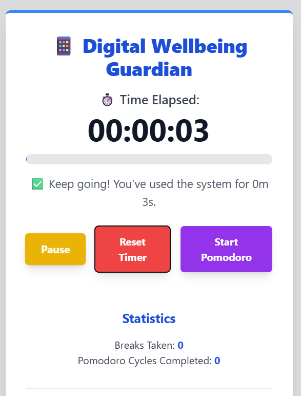
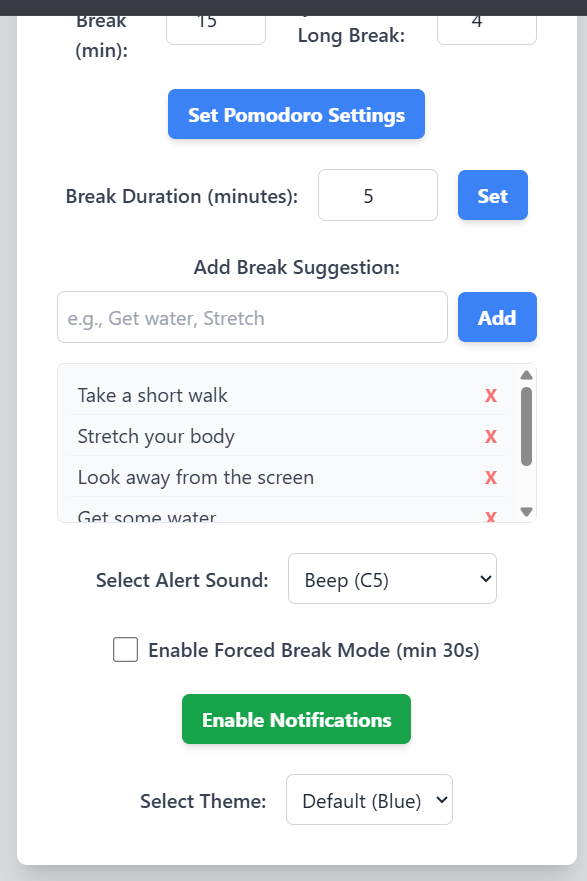
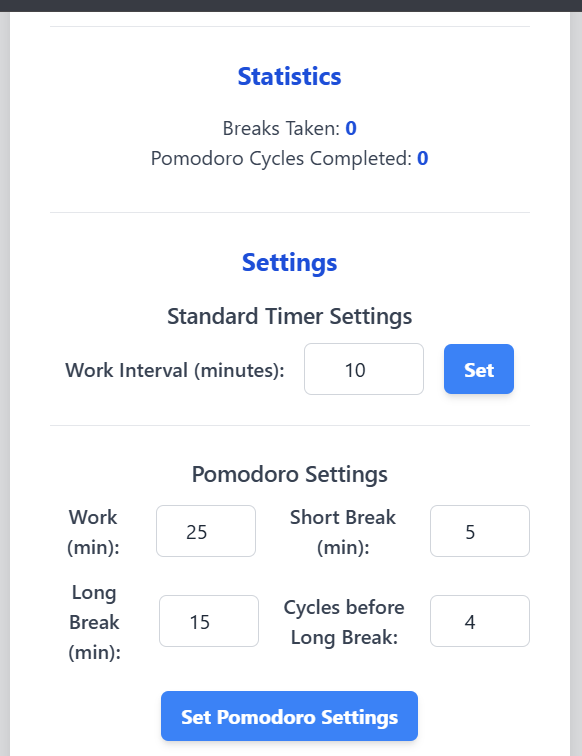

# 📱 MindGuard AI

> An AI-powered Digital Wellbeing and Productivity Assistant that helps users build healthier screen habits through smart break reminders, customizable timers, Pomodoro sessions, browser notifications, and productivity tracking.

---

## 🌟 Features

- ⏱️ Real-time Screen Time Tracker
- 🍅 Pomodoro Timer (Work, Short Break & Long Break)
- ⚙️ Customizable Work & Break Durations
- 📊 Productivity Statistics
- 💡 Personalized Break Suggestions
- 🔔 Browser Notification Alerts
- 🔊 Multiple Alert Sounds
- 🎨 Multiple UI Themes
- 🚫 Forced Break Mode
- 💾 Local Storage Support
- 📱 Responsive User Interface

---

## 🛠️ Tech Stack

### Frontend
- HTML5
- CSS3
- JavaScript
- Tailwind CSS

### Backend
- Python
- Flask

### Browser APIs
- Notifications API
- Local Storage API

### Libraries
- Tone.js

---

## 📸 Screenshots

### 🏠 Home Page



---

### ⚙️ Settings



---

### ☕ Break Manager



---

## 📂 Project Structure

```text
MindGuard-AI/
│
├── app.py
├── config.py
├── requirements.txt
├── Procfile
├── .gitignore
├── .env
│
├── templates/
│   └── index.html
│
├── screenshots/
│   ├── Home-Page.png
│   ├── timer-settings.png
│   └── Break-manager.png
│
└── README.md
```

---

## 🚀 Installation

Clone the repository

```bash
git clone https://github.com/khushiinegi/MindGuard-AI.git
```

Move into the project

```bash
cd MindGuard-AI
```

Install dependencies

```bash
pip install -r requirements.txt
```

Create a `.env` file

```text
GEMINI_API_KEY=YOUR_API_KEY
```

Run the application

```bash
python app.py
```

---

## ✨ Future Improvements

- 📈 Weekly productivity analytics
- 👤 User authentication
- ☁️ Cloud database integration
- 🤖 AI-powered productivity insights
- 📅 Calendar integration
- 📄 PDF productivity reports
- 📊 Interactive charts

---

## 📌 Project Highlights

- Responsive Web Application
- Modern UI Design
- Productivity-focused Features
- Secure API Key Management
- Flask Backend
- Browser Notifications
- Customizable User Experience

---

## 👩‍💻 Author

**Khushi Negi**

- GitHub: https://github.com/khushiinegi
- LinkedIn: *(Add your LinkedIn profile here)*

---

## ⭐ Support

If you found this project useful, consider giving it a ⭐ on GitHub!
